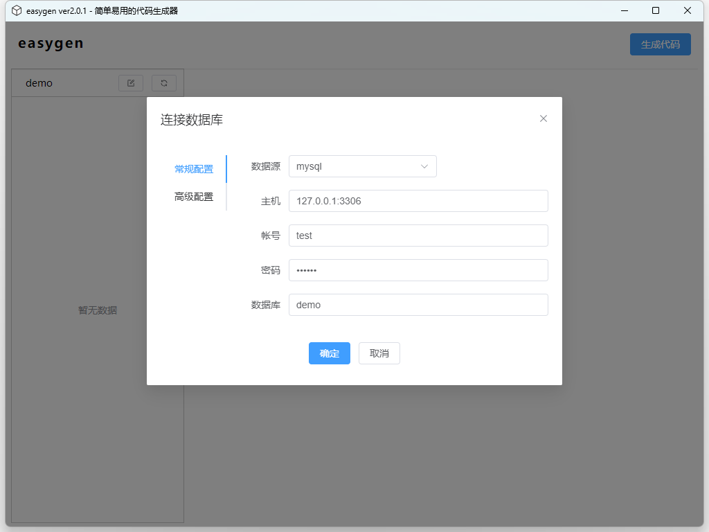
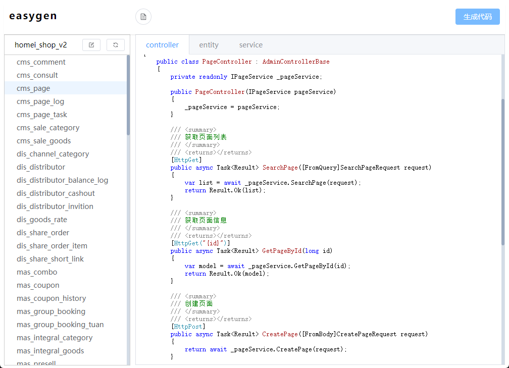

# easygen 
一款简单易用的代码生成器，可以有效减少重复劳动，提升开发效率。

A simple and easy-to-use code generator that can effectively reduce repetitive work and improve development efficiency.

## 如何安装
 [直接下载](https://github.com/faith0831/easygen/releases)编译好的二进制文件解压服用^_^

## TODO
- [x] 支持mysql
- [x] 支持mssql
- [x] 支持csharp
- [x] 初步支持golang
- [x] 简易的ui
- [x] 优化ui
- [x] 支持更多语言
